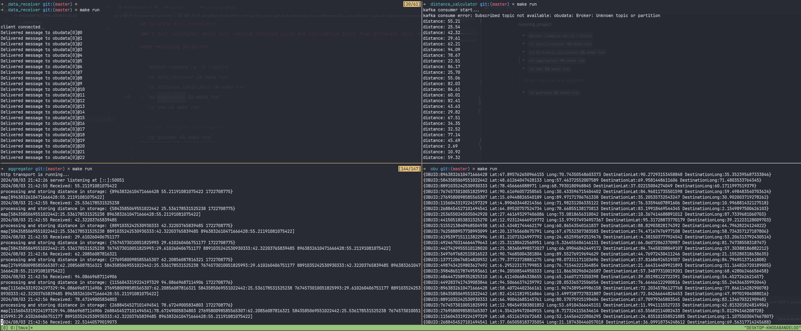

## Accurate toll calculator

### A toll calculator which will receive starting point and destination point from different OBUs, and calculate total toll costs and create invoice

> run `docker compose upd -d --build` to run kafka broker

#### Summary of what each microservice will do

- obu \

> It's just a mocked obu that will send starting point and dentation for us to process and calculate

- data_receiver

> Will receive data through websocket connection and produce calculated distance to **Kafka**
>
> - Listen to the socket for receiving data
> - Validate encoming request
> - Produce to kafka

- distance_calculator

> Will consume data from kafka, and calculate toll price and send it to **aggregator** microservice using HTTP or gRPC clients
>
> - Consume to obudata topic
> - Calculate distance for the obu
> - Send calculated distance to aggregator service using gRPC or HTTP clients

- aggregator

> Will receive, aggregate and return invoices for OBUs
>
> - Will aggregate invoices via gRPC and HTTP
> - Will process, calculate and return invoice for an OBU

- gateway

> Gate way to interact with microservices
> - Has **/invoice** endpoint, which will get an OBU id
> - Will get invoice for entered OBU from the aggregator service using gRPC or HTTP client
> - Return invoice to user
----------

#### **running project**

- `docker compose up -d --build`
- `cd data_receiver && make run`
- `cd distance_calculator && make run`
- `cd aggregator && make run`
- `cd obu && make run`

> to use the gate way endpoint
- `cd gateway && make run`

